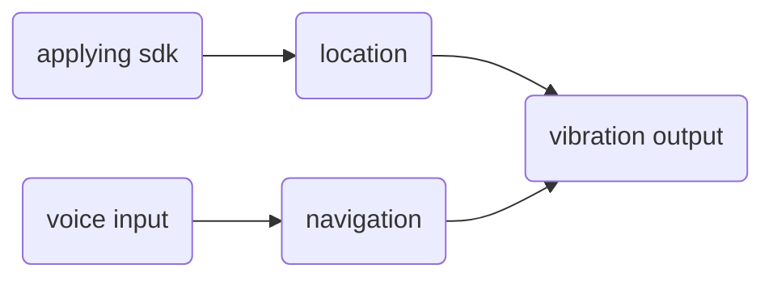
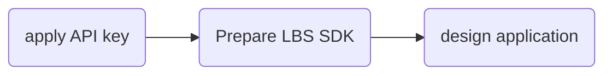

## Purpose
With the rapid development of mobile applications，Android—based mobile applications constantly innovation，various Android application store in the number of applications is increasing．But how to use innovative applications to help people with disabilities，is currently a major focus of the problem. Nowadays, apps designed to meet the special needs of blind people are restricted in numbers, and our project–“Seeing eye dog” is targeted at such need to offer a third eye for the blind people.

## Logo 
Our app name is Seeing-eye dog, which means it is a good friend of the blind people.

The four circles stand for the four members of our group. It also represents the all-round communication and travel of blind people with the help of our app. "The third eye for the blind" is our motto.

## Platform and Development environment
- Android 7.0
- Android Studio 2.3.2

## Function Implementation

### Location and navigation
There is one advantage of mobile device over PC is that it can be taken with you easily. Therefore, LBS, short for Location Based Service is a technology almost only available on mobile phones. The core of LBS is to locate users. There are mainly two ways to achieve this goal, that is, through GPS and through WiFi. The first method is based on the interaction of GPS hardware inside our phones and satellites. Users can be located precisely in this way but it is only useful outdoors. The second method depends on three base-stations to determine the velocity and then calculate the positon. This way is less accurate but is available both indoors and outdoors. Although android has provided corresponding API support for both two ways, there are some problems in practice. To improve accuracy as well as save time, we choose the third way, using SDK of third companies (AMAP). The procedure is applying API Key first, then preparing LBS SDK, and finally we can design our own application. 

Then if all of them are accepted, we can begin our location. We call some inside method to get latitude and longitude, as well as the exact city and road to tell users where they are in a more acceptable way. The time interval is used to set interval of two location, through which we can change our position synchronous in the map and get information of the whole trail we have moved visualized.

Once user presses the left button, a complete map will be showed; if user presses the right one, the application will turn back to the main interface. In the map before, user can zoom in and out by sliding their fingers or pressing "+" or "-".

### Voice Recognition
This function is fulfilled to assist the blind as well as other users to locate their destinations with higher speed and more convenience. Through the calling of `Hearing Fei voice SDK`，accurate and efficient voice recognition is accomplished. 

To provide vivid and real-time interactive experience, 

The result is satisfactory for the high accuracy and vivid interface.

### Vibration Output

This function is specially designed for blind people. The blind people boasts sensitive tactile and auditory. However, because of the noise generated by busy traffic on the road, it is practically rather difficult for the blind people to know their location and identify their environment through apps simply by their hearing. For example, if simply focusing on the app wearing a headphone, it is difficult for them to identify the horns of vehicles, which may otherwise be useful for them to navigate for some safety concern. 

To solve this problem, vibration is adopted in our APP, for its **in-time** and **noise proof** advantages, which  perfectly fits in with the features and demands of blind users. To be specific, the method of **difference-vibration** is implemented:

- Short vibration:
	- Waiting time:1s
	- Lasting time:0.05s
- Long vibration:
	- Waiting time:1s
	- Lasting time:1s
	- The vibration can achieve its peak.

### UI design
Since the users are divided into 2 groups — blind and normal people. Ways of input includes typing input and voice-input. Their texts are all clearly replaced by icon buttons, to make the interface more attractive, some additional decorations are rejected to make the interface more user-friendly. In the lower right hand corner is our app logo and in the lower left hand corner is user’s command and it also supports voice-input.

#### Main interface & Position track

#### Voice recognition

## Conclusions
Our completion of the final project, thanks to the joint effort, is satisfying. We accomplished following features:
1. Navigation function via Amap and location sdk.
2. Voice recognition and vibration output to receive and deliver information.

This is our first time to experience android development, and naturally, this project has a lot to improve:
1. Without voice output, it is still not convenient enough to use ”Seeing Eye dog”.
2. The functions are limited in numbers and could be made more diverse, such as travel sharing, etc.

## Summary and Future perspectives
Through this project, we have fully experienced the fun and sense of achievements of accomplishing an visible outcome and fall in love with android development. Limited by the time, many additional functions are not be able to implemented. If added, "Seeing-Eye dog" app will undoubtedly have more practical use and enrich the life of the user groups to a larger degree. We hope to have the opportunity to turn these functions into realities in the future.

1. More services closely related to the life of the blind can be added. For example, the restaurants and entertainment facilities nearby to enrich the otherwise dull life of the blind people.

2. Personally made service can be added to be more intellect, and suit users’ demands better.

3. Share function can be added to enable the blind to share their travelling path among their friends and families

To sum up, technology will improve and enrich people’s life. We should tap the potential of the technology to make more products better satisfying the special need of those underprivileged who have long been easily ignored. And only by doing so, can the technology be made full use of, thus eventually changing the world into a better place for all humanity.