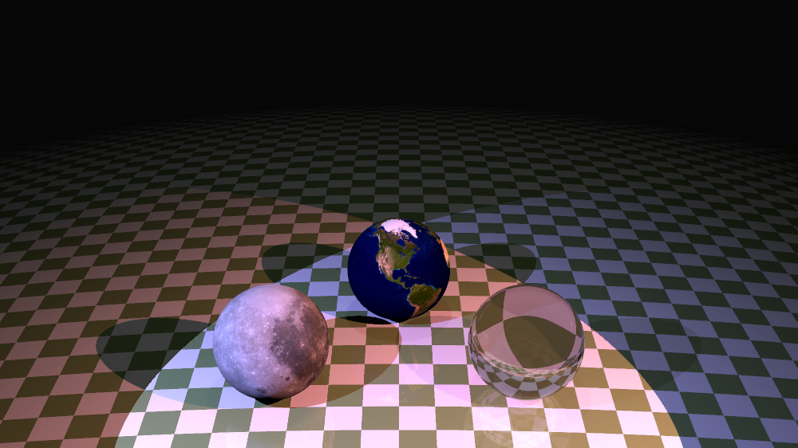

## Procedural Fire Flame

Procedurally generated fire flame implemented with particle system on top of Three.js.

## Ray Tracer 
Implemented a ray tracer with features including phong shading, refraction, point light and spotlight source, anti-aliasing, texture mapping, etc. 

## Kitten Kitten Desert
A procedurally generated world developed in AniGraph on top of Three.js and WebGL. The player can control a magical cat on a journey who hates desert and she summons some rainwater and throws kitten combs to explore the underground water resources.

Mainly responsible for the implementation of the camera and player control as well as the water shader and terrian shader. Developed features like Phong shading, reflections, waving and blooming effect, microfacet reflection, rim lighting, and more.

<!--  Source Code *(Releasing soon)* -->
