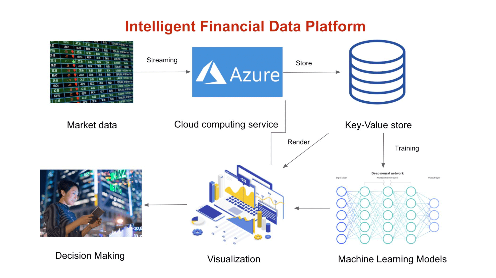
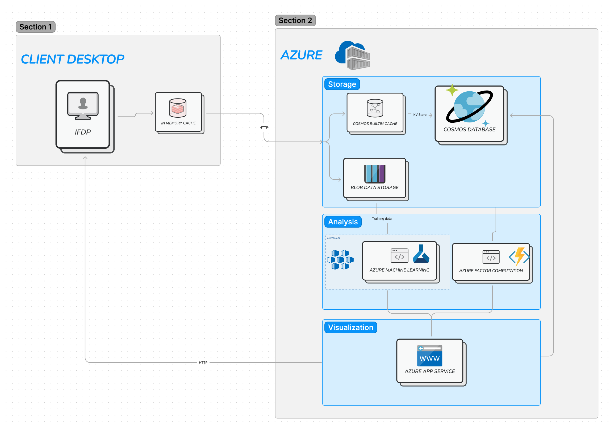
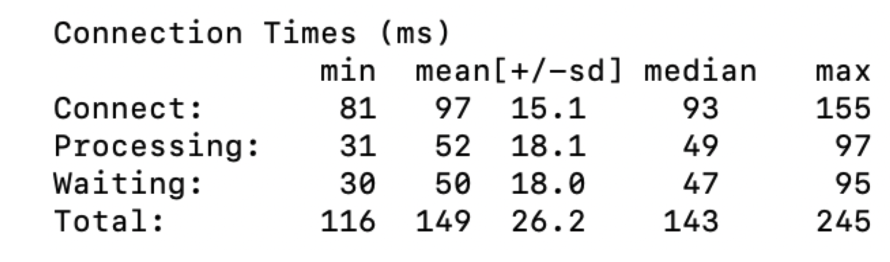

_Project for CS5412: Cloud Computing, a graduate-level class instructed by Ken Birman at Cornell University._

# Project Goals
With the advance and applications of computer technologies in the financial market, the transmission and execution of orders are now faster than ever. The emergence of High-Frequency Trading (HFT) requires the technology support of <mark style="background-color: #FFD773">high-speed and low-latency information exchange.</mark> In addition, with the growing need for a higher frequency of data, more and more financial data is generated every day. Gigabytes, if not Petabytes, of data, are requested from the client to do all kinds of <mark style="background-color: #FFD773">large-scale computing</mark>.

## Application Scenarios
- A quant researcher who wants to do quantitative finance research using IFDP to search for the market data of specific stock tickers given a time range.
- A discretionary investor needs to know the summary and statistical analysis of the requested output market data, and a bar chart visualization of the price evolution.
- An investor who wants to apply advanced machine learning techniques to understand the predicted mean value of the future stock price.

In this project, cloud toolkits are leveraged to solve this kind of issue. Specifically, cloud database and services provided by Microsoft Azure is utilized to support the need for computing resources, data storage, and network speed. CosmosDB and Blob storage is designed to be the data storage system; Azure Machine Learning components are used for the computation and prediction process; App Service and Azure functions are used for the final deployment of the application. More details will be provided in the Architecture section.

<!-- ## Background
There are three pillars in the world of trading: data, software systems, and algorithms. From the perspective of data, financial companies need to aggregate price data from all around the world (from London to Shanghai) in a low-latency fashion so that traders can execute their algorithms faster than others, which is of critical importance. However, the ‘Data burst’ problem arose in this scenario. The incoming data stream of financial data does not follow the classic Poisson process because two traders’ algorithms are not independent of each other. As illustrated in the graph below, the distribution of transactions message arrives ratio does not follow the normal distribution or possession distribution. 

To aggregate the data message in milliseconds granularity, it is almost not possible for a single cluster to handle such a massive amount of messages that burst within one second. The popular solution in the industry includes building a larger data center, reducing part of data, or distributed data storage. However, all the solution above is not for regular discretionary clients. We need a solution that is fast, scalable, and achievable. Therefore, IFDP is proposed. -->

# Data Source

Direct connection to the stock exchange requires permission from a broker, which is not part of our project. An intermediate layer is inserted and Yahoo Finance API is used to update IFDP in a real-time fashion. The input data will be a minute-level time series data stream of stock indicators (high, low, close, open, volume). During open market hours, IFDP will routinely keep track of a selected group of stocks by its stock ticker symbols and update the stock price in a low-latency way. 

# Architecture & Implementation

The Intelligent Financial data platform (IFDP) is built with MVC architecture. Clients will interact with a frontend web page (View), which will be parsed and passed to different handlers (Controller) and all the computation and data storage will happen in the backend (Model). More details will be elaborated below.

## Infrastructure Layer

IFDP will handle a large-scale dataset of financial asset price data in real time. It is intuitive that it is stored in a <mark style="background-color: #FFD773">key-value pair</mark> where key is a concatenation of time, and ticker name, while value is a json object for the quantitative price factors. Therefore, IFDP is designed to use the Cosmos Database provided by the Microsoft Azure cloud platform as its storage system which allows a 10-20ms low-latency request response time fitting the requirements of IFDP. Also, under the consideration of repetitive read, we integrated Cosmos cache which boosts the performance. Other than NoSQL, IFDP also integrates Blob storage to store large training datasets to satisfy large-scale training needs.

## Data Analytics Layer

Once the stock data stream is deployed in Cosmos Database, the Azure Machine Learning designer is utilized to fulfill advanced application scenarios such as providing users with summary and statistical analysis and prediction of the next move of a stock. In detail, Azure Container Instance is deployed and a pipeline with modifiable modules is created that starts from importing and preprocessing data in the Cosmos Database. In this layer, all the tasks of generating training and testing datasets, training a machine learning model, and scoring and evaluating the trained model will be executed. Kubernetes will be used to dynamically allocate resources and scale the machine learning systems.

## Visualization Layer

Visualization is the most straightforward way of representing the movement and fluctuation of financial data. Therefore, IFDP is designed to integrate multiple visualizations and user interfaces to help clients to understand the trend of the current market, such as financial asset price retrieval, line charts, etc. As illustrated in the architecture diagram, IFDP incorporates the App Service of Azure in which the production team can deploy the backend and controller of IFDP on Azure and provide fast and reliable service for the clients by using the Flask framework to support the CRUD operations. The respective charts and visual components will be rendered through Plotly for the end-users to interact with.

# Evaluation

We evaluated the performance and scalability of our cloud system based on the latency of each request for the same message with Apache Bench. The size of each request message is 106981 bytes. We set different numbers of total and concurrent requests and analyzed the average latency. The network delay versus computing delay is approximately 2:1, as illustrated in the delay breakdown below.

We also run an experiment with 5000 requests on different concurrency levels (indicated as x-axis). As illustrated in the graph, the average response time doesn’t increase with the increase in the number of concurrent requests sent to the system. <mark style="background-color: #FFD773">It slightly decreases as more threads are added, indicating that our system has a good scalability.</mark> 

We also evaluated our online deployed predictive model according to the classic benchmarks. The model achieves a 0.999 Spearman correlation and 0.999 R2 score, indicating a good predictive performance.

# Screenshot

# Conclusions

To solve the data burst problem in the stock price market, we proposed and developed the Intelligent Financial Data Platform to retrieve and update stock price in a low-latency and real-time fashion. We employed Azure components such as CosmosDB, Automated AI and App Service, etc. to accomplish the tasks in a scalable and high-performant way. Future work includes further improvements on the system scalability and performance, real-time price prediction, as well as more detailed statistical analysis and dashboards to provide investment insights.

 [Source Code](https://github.com/LiPGa/IFDP)
