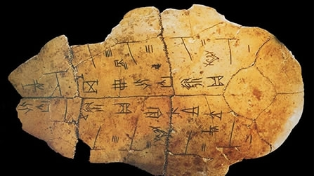

# Introduction

Oracle bone inscriptions (OBIs) are some of the oldest characters of Chinese words, which were hieroglyphic signs inscribed onto cattle bones or turtle shells with sharp objects about 3000 years ago. OBIs are very important to exploit the political systems, economic status and social lives of Shang Dynasty (about 1600 B.C. -1046 B.C.), the first dynasty recorded by Chinese words found so far. However, few people have the literacy of OBIs. The recognition of OBIs, which interdisciplinarily combines archaeology, history, philology and literature, requires people to have plenty of knowledge and years of experiences.

# Data set

# Models
- CNN: We adapt **AlexNet**, altering its kernel sizes, paddings, numbers of channels, and strides, for this task.
- SIFT/SURF: We adopt two methods for scaling and rotation invariant interest point/feature detector and descriptor: Scale Invariant Feature Transform (SIFT) and Speed Up Robust Features (SURF). After extracting features, we perform a quick and efficient matching by using the **FLANN** (Fast Approximate Nearest Neighbor Search Library).
- Template matching: Template Matching is a technique for finding areas of an image that match (are similar) to a template image (patch). Template matching works by "sliding" the template across the original image. To avoid the issue caused by the different sizes of the template and original image we use **multi-scaling**. 

## Experiment Results:

## Real Scence Tests:
We mannually write some oracle bone characters in different scenes to test the performance of our models. We modify the background color of paper, the intensity of light and add moderate noises to test the robustness of our models. All of our models generate desirable classification results. 

# Analysis

### Supervised Methods
For AlexNet model, we conduct experiments to investigate the impact of $augment\_p$ on performance. Each training instance is transformed with probability $augment\_p$. As is shown, performance peaks at $augment\_p=0.7$, and further raising $augment\_p$ hurts the performance.

### Unsupervised Methods
For SURF/SIFT and Template Matching models, we randomly sample 20% of the dataset and test their results by comparing them with the rest 80\% target characters. As can be seen from Table I, SURF and SIFT achieve comparable classification results while Template Matching outperforms them. SURF outperforms SIFT in 40-way classification (variant word recognition). However, in recognition of the same meaning, SIFT performs better. 

# Conclusions and Future Works
In this work, we implement **CNN, feature-based and template-based** approaches for recognition of oracle bone characters. In the future, we plan to adopt other neural network models (e.g. ResNet), data augmentation methods (e.g. horizontal flip) and other feature extraction methods (e.g. BRIEF and ORB) to further analyze their strengths and weaknesses.

 [Source Code](https://github.com/LiPGa/OBI-recognition)
# References
1. A. Krizhevsky, I. Sutskever, and G. E. Hinton, “Imagenet classification
with deep convolutional neural networks,” in NIPS, 2012.
2. P. Panchal, S. Panchal, and S. Shah, “A comparison of sift and surf,”
International Journal of Innovative Research in Computer and Commu-
nication Engineering, vol. 1, no. 2, pp. 323–327, 2013.
3. D. Mistry and A. Banerjee, “Comparison of feature detection and match-
ing approaches: Sift and surf,” GRD Journal, vol. 2, 2017.
