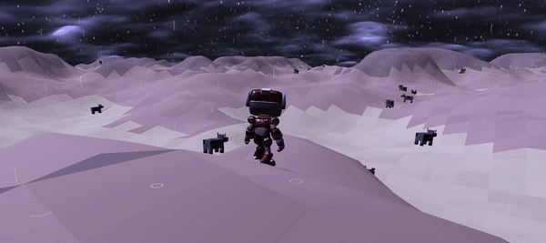
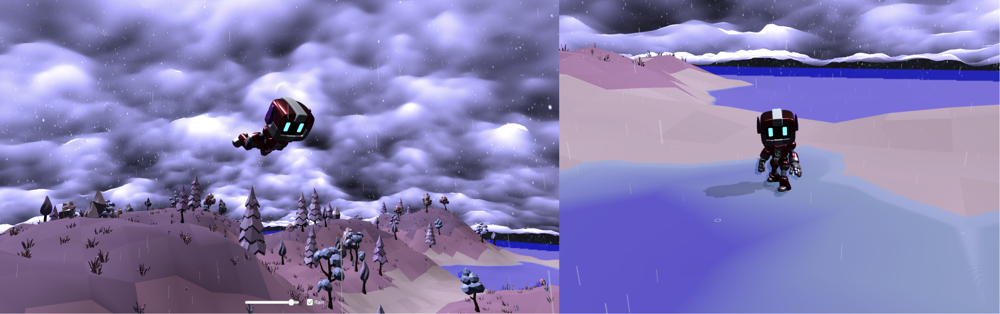
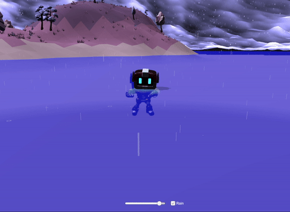
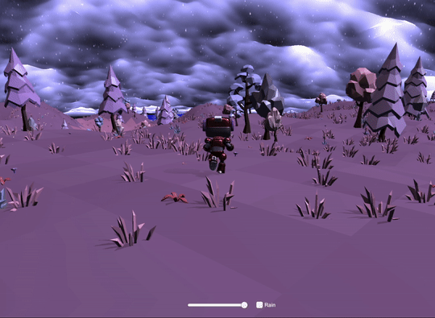
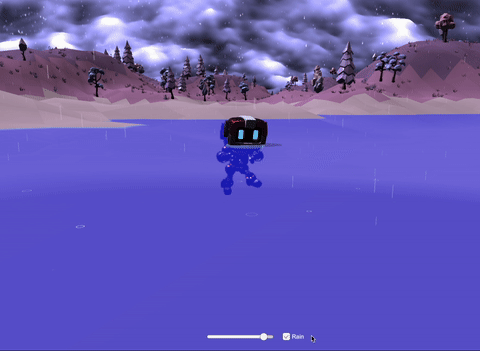

Inspired by the *Sakura Planet* in Dyson Sphere Program, this is a procedurally generated world in a space-forest theme, combining with XR (VR/AR) technologies in Unity. 

## Terrian and Forest Generation

## Run-time slider

## Character, Camera, and Animation 

## VR Integration

 Source Code (Releasing soon)
