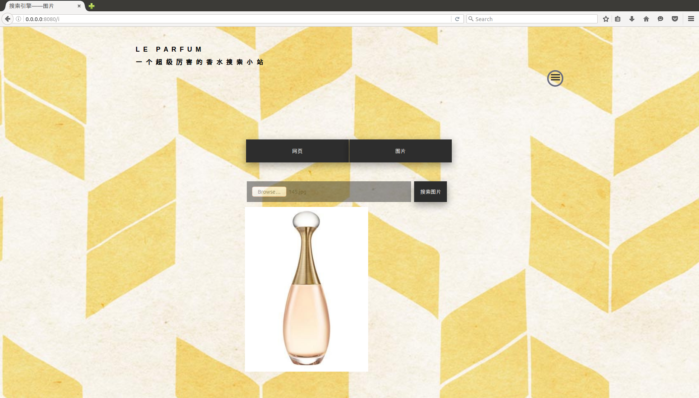
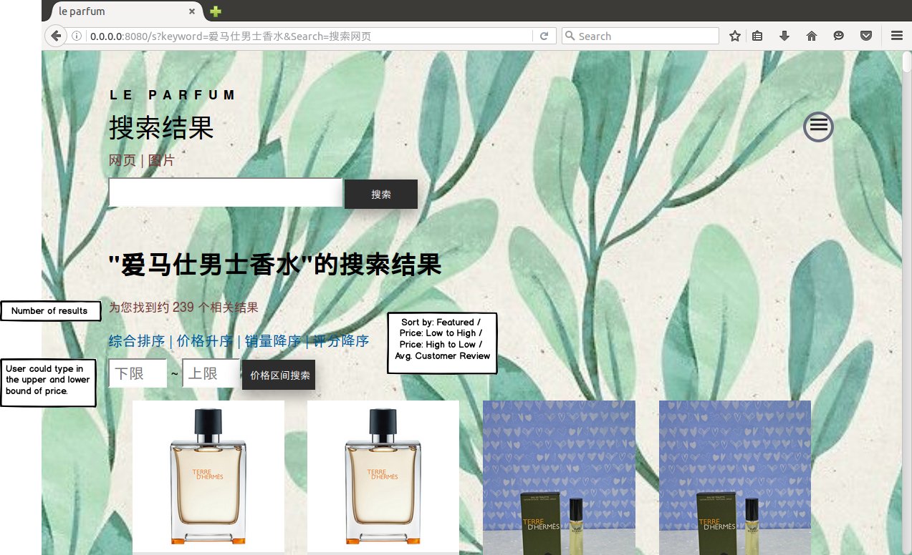

## Background
The process of searching perfumes and purchasing perfume are **seperated** from each other. The perfume shopping websites generally do not provide much detailed product information, such as the front, middle, and back notes, perfumers, etc. Similarly, perfume review sites do not provide functionalities like navigation to the shopping page. 

> Users who want to buy perfumes but are not familiar with them have to go to perfume review websites like Nosetime or Xiaohongshu to look for a desirable perfume. However, if they've decided what to buy, they have to search again on shopping website like Taobao. 

There is no specific perfume shopping website on the market, which brings a lot of trouble to users' demands.
Therefore, this perfume searching and shopping site is designed and developed to meet the personalized purchase needs of users by integrated and all-round information.

- User could search perfumes by text and image.
- User could be navigated to the shopping site in the result page.
- User could combine different features to dig out favourite product. 

The text searching function is implemented through Apache Lucene. The image recognition is implemented using ORB operator and brute force matcher provided by OpenCV.  

## Interface

Menu Page:

Search by Text:

Search by Image: 

Muti-field Search: 

Search Result:

## More Features
- Leverage regular crawlers of Taobao and Nosetime to collect information on a daily basis to keep the database information up-to-date.
- Fuzzy Search to improve the robustness of the seaching function.
- Offer suggestions based on search and web history before user finish typing.
- Price prediction, personalized product recommendation based on the data collected. 

