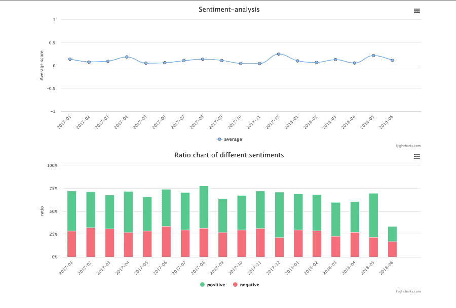
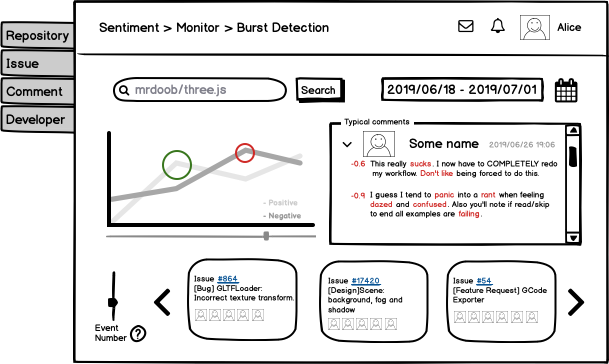
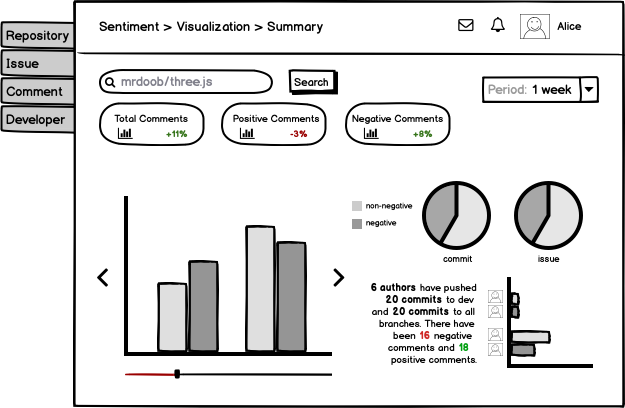

## Introduction
On GitHub, issue reports are used by team members to ask for advice, and express and share opinions related to software maintenance and evolution. 
Issue data can be mined to explore developers emotions, sentiments and politeness---affects for short. 

> It is becoming apparent that emotion awareness, awareness of one's own emotions and those of others, is crucial for a software company and for many stakeholders involved in the software development lifecycle.

It is important to improve Emotion or Sentiment awareness in Open Source Software developments. Although monitoring systmes for emotion phenomena detection has been studied in social media, there is no studies on tools to monitor sentiment phenomena in software development communities.

This design could provide an alternative view to evaluate the health status of open source software projects (from a social and pshychological point of view). 

## Workflow

- All the data is automatically collected using [REST API v3](https://developer.github.com/v3/).
- Sentiment Analysis is performed using SentiCR and an SE-specific sentiment lexicon.
- Burst detection is implemented through Kleinburg model and Event extraction is fulfilled through LDA Topic extraction. 

## Data Analysis and Visualization
Visualization of sentiment status of all the **commit** comments in a given repository (individual work):

Visualization of all the **issue** comments in a given repository (collaborative work):

These two graphs can provide a general idea of the sentiment status of the project by simply displaying the generated time series and summary information. Based on them, I further design some interfaces for the sentiment monitoring system.

### Examples

> As the Project Manager, I want to know whether there is a burst of a certain sentiment and what events lead to such sentiment phenomena. 

Prototype of Burst Detection and Event Extraction:

- Detected events could link to corresponding GitHub pages, enabling user to know details of the event.
- User could select a specific time period and the system will detect sentiment burst and related events during this period. Typical comments will also be listed with sentiment score and keywords displayed to the user. 
- For better accuracy, user could adjust number of events to be detected by the model during the burst period.
- User could watch the project he/she is interested in. Whenever there is new detection, user could receive notifications.

> As the Software Quality Assurance team member, I want to see the overall sentiment state of the project in the past period such as one week, one month, one year, etc., so that I can correlate it with other metrics, such as productivity, task quality, etc.

Prototype of information visualization and summary on a given time period:
- Enabling sliding window for adaptive visualization.
- Provide selection on time period and look for database or automatically collect data during that period from GitHub.
- Provide issue and commit comment data summary.
- Automatically compare the result with the summary over the last period.
- Give advice based on some embeded knowledge. (e.g, Since research has found that positive sentiment can reduce issue resolution time, the system can help QA team member to evaluate productivity accordingly.)

