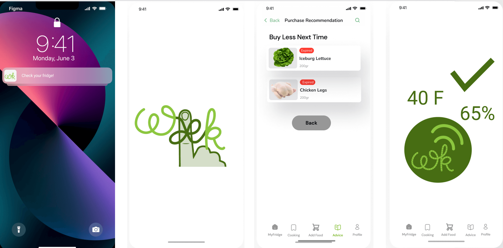
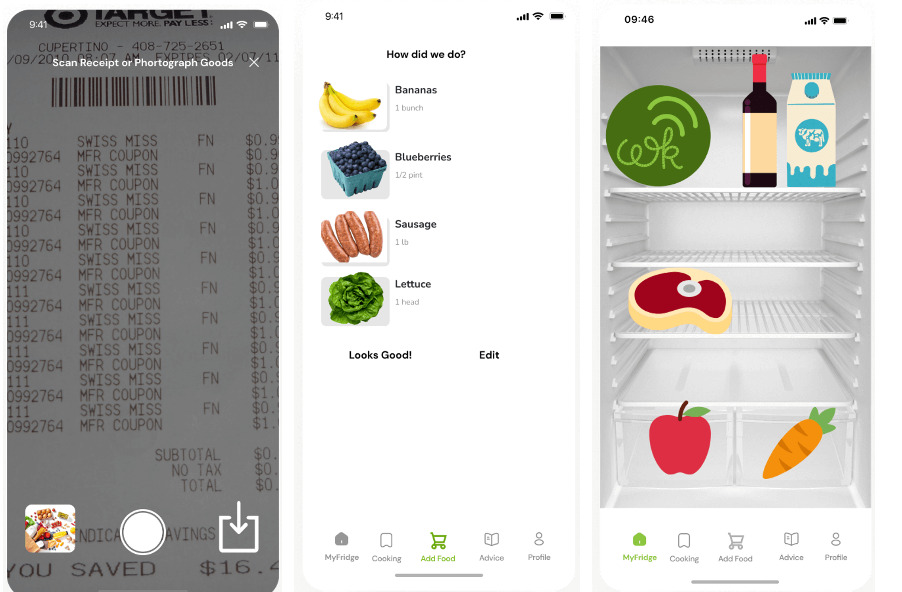
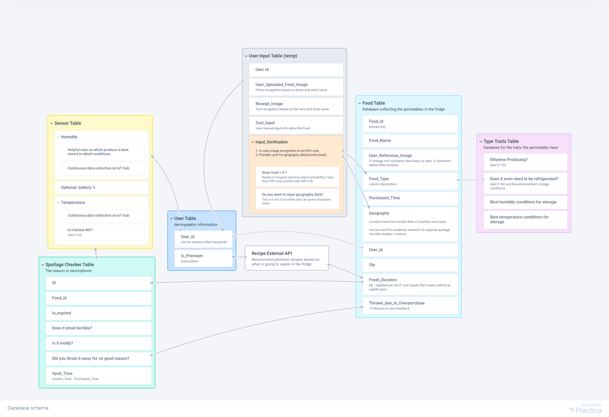

# Introduction

Waste Knot is a grocery spoilage prevention technology. We provide a sensor for your fridge and inventory management app that results in savings and less waste. 

<mark style="background-color: #FFD773">About 60% of food waste happens in the fridge,</mark> so that's where we start. We monitor storage conditions, provide user grocery tracking and harness this data to better predict and
ensure shelf life quality health for our consumer.

# APP Design 

Grocery entry is easy with waste. As a customer just going home from the store. I can enter
groceries by uploading an emailed receipt, submitting a photo of the receipt, or the goods myself. From there, Waste Knot will parse this data and present a summary for me to edit or approve. Grocery data is then sent to waste knot to calculate and inform machine learning models that predicts the shelf life of each item. To makes monitoring easy, Waste Knot can send me notifications when food is about to spoil. Then I can provide input on whether or not I will use the item. I can choose to contribute more information about why. If you're on an item, adding to the waste knot knowledge base. This data would feed back into the waste knot pipeline, to help suppliers better understand how to package goods and for me to have a better sense of the quantities of items I should buy next time.

Waste knot is not just a monitor, it's also an <mark style="background-color: #FFD773">advisor</mark>. Waste knot provides suggestions on best food placement within the fridge and storage methods based on rigorous science research. Plus waste not offers cooking integrations for more efficient meal planning and fun. Leftover ideas for super users. The app also supports integration of IoT sensors that enabled sensors to make predictions even more accurate. Users can rely on waste knot for the most accurate prediction of food, ripening and spoilage. 

 

<!-- <iframe style="border: 1px solid rgba(0, 0, 0, 0.1);" width="800" height="450" src="https://www.figma.com/embed?embed_host=share&url=https%3A%2F%2Fwww.figma.com%2Fproto%2FdQCzVMZssYEPJh2SQVmBep%2FUntitled%3Fnode-id%3D15%253A960%26scaling%3Dscale-down%26page-id%3D0%253A1%26starting-point-node-id%3D15%253A960%26show-proto-sidebar%3D1" allowfullscreen></iframe>
 -->

# Data Schema
The data input for Waste Knot mainly comes from two sources: we have data uploaded by users as well as collected from IoT sensors. They are streamed and stored into the IoT hub, where the machine learning model is trained to provide customers with the prediction results on spoilage and purchase recommendations.  

The data on consumers' fridge condition is also a valuable data source to local business partners. For microbiology researchers, the data on spoilage versus geography and time could also be useful dataset for the academic purpose. 
 

# Demo

 

# Conclusions
Waste Knot will be <mark style="background-color: #FFD773">filling in the last mile of food traceability</mark>  while targeting measurable reduction of household food wastes with data collection on spoilage like never before. To our stakeholders, we want to not only have short-term economic benefits but also setup the stage for a more transparent, scalable, and efficient future for food consumption.  

<mark style="background-color: #FFD773">This is a user-first grocery tracking and storage monitoring platform, forging connections to prevent food waste, ensure quality and health.</mark>  We will build adoption from suburbia but end as a global service in the long term. 